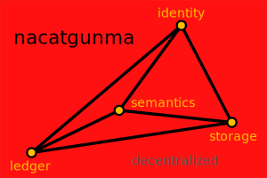

# Colophon



**nacatgunma** *(Lojban lujvo)*

*from* **na** *(not)* + **catni** *(authoritative)* + **gunma** *(collective, mass)*

lo gunma poi na se catni – lo gunma cu se zbasu gi'e renro lo catni.
.i lo nacatgunma cu gunma na se catni gi'e panra lo gunma poi co'a jivna lo ka terdi selcatni.

**Gloss:** *non-authoritative collective*

A coined Lojban compound denoting a group or collective that explicitly lacks hierarchical authority or imposed leadership. It reflects the ideal of decentralized consensus and mutual association without coercive control.

This term was created to characterize systems—such as trust-based blockchains, anarchosyndicalist federations, or distributed knowledge networks—that operate without centralized command, emphasizing autonomy, solidarity, and cooperative structure.

```turtle
@prefix ontolex: <http://www.w3.org/ns/lemon/ontolex#> .
@prefix skos: <http://www.w3.org/2004/02/skos/core#> .
@prefix lexinfo: <http://www.lexinfo.net/ontology/3.0/lexinfo#> .
@prefix dcterms: <http://purl.org/dc/terms/> .
@prefix ex: <http://example.org/lojban#> .

ex:nacatgunma a ontolex:LexicalEntry ;
    ontolex:canonicalForm [
        ontolex:writtenRep "nacatgunma"@jbo
    ] ;
    ontolex:sense ex:nacatgunma-sense ;
    lexinfo:partOfSpeech lexinfo:noun ;
    skos:definition "A non-authoritative collective; a group explicitly lacking hierarchical authority or imposed leadership."@en ;
    dcterms:source <https://jbovlaste.lojban.org/> ;
    dcterms:creator "Brian Bush" ;
    skos:note "Constructed from rafsi: na (not), cat (authoritative), gunma (group)"@en .

ex:nacatgunma-sense a ontolex:LexicalSense ;
    skos:definition "lo gunma poi na se catni"@jbo ;
    skos:example "lo nacatgunma cu simsa lo kibystu poi na se catni gi'e bandu lo panra be lo gunma poi co'a jivna lo ka terdi selcatni."@jbo ;
    skos:definition "A collective formed without top-down authority."@en .
```
