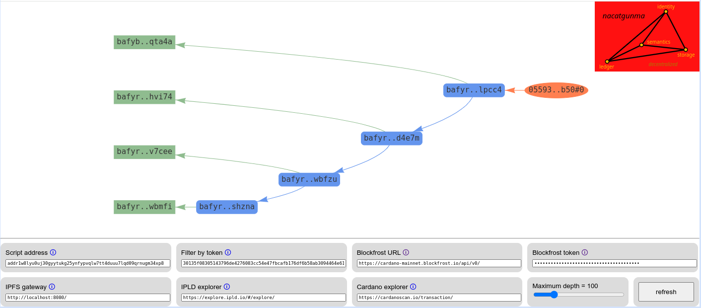

# Nacatgunma explorer web applications

This explorer finds the tips of the Nacatgunma blockchain on the Cardano mainnet and then visualizes the headers and blocks available on IPFS. This serverless web application is live at https://ipfs.io/ipfs/bafybeighyzhjjjnh7rcdz25xuok2wcmr2rnffwv2rqyr5ff3vc7bwqta4a.

## Source

- [index.html](index.html)
- [view.css](view.css)
- [src/controller.js](src/controller.js)
